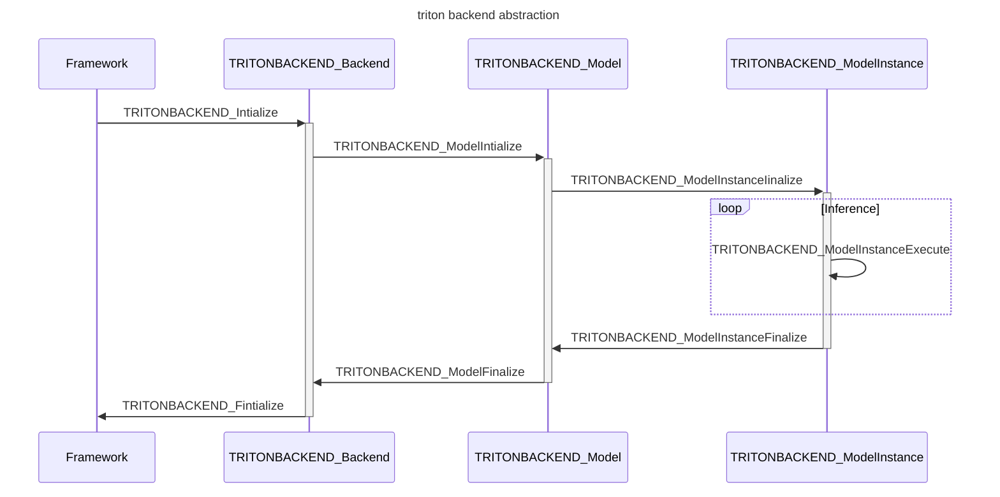
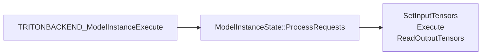

# Nvidia Triton Inference Server

we refer Triton Inference Server as triton for short in the following doc.

Table of Contents:

* [what is triton](#what-is-triton)
* [git repos](#git-repos)
* [how to start tritonserver with NGC](#how-to-start-tritonserver-with-ngc)
* [how to prepare model repository](#how-to-prepare-model-repository)
* [triton backend](#triton-backend)
    * [python backend](#python-backend)
* [model ensemble](#model-ensemble)
* [Business Logic Scripting](#business-logic-scripting)
* [FAQs](#faqs)


## what is triton

Developed by nvidia, Triton is a software toolkit to deploy and serve machine learning models. the model may be trained with different machine learning frameworks, such as tensorflow, pytorch. and may be in different formats, such as SavedModel for tensorflow, torchscript for pytorch, or other format such as ONNX, TensorRT. you can serve one or more models in one triton server, and you can even orchestrate how multiple models work
together to solve tasks which may be difficult for one model, such as detecting objects in images, generate images from texts.

TODO: add mermaid images about triton system


## git repos

* [triton-inference-server](https://github.com/triton-inference-server)
    * [triton-inference-server/common: proto, ModelConfig](https://github.com/triton-inference-server/common)
    * [triton-inference-server/backend](https://github.com/triton-inference-server/backend)
    * [python_backend](https://github.com/triton-inference-server/python_backend)


##  how to start tritonserver with NGC

```bash
# triton on NGC: https://catalog.ngc.nvidia.com/orgs/nvidia/containers/tritonserver
# docker pull nvcr.io/nvidia/tritonserver:24.01-py3

# docker images
REPOSITORY                    TAG         IMAGE ID       CREATED        SIZE
nvcr.io/nvidia/tritonserver   24.01-py3   4f00c79d1c09   6 months ago   14.7GB

# docker run --gpus all -t -d --rm --ipc=host --network=host --ulimit memlock=-1 --ulimit stack=67108864 -v /home/cuiyongbo/tensorflow-workspace/data-store/huggingface-store:/model-store nvcr.io/nvidia/tritonserver:24.01-py3

# docker container list
CONTAINER ID   IMAGE                                   COMMAND                  CREATED          STATUS          PORTS     NAMES
0269f37660a5   nvcr.io/nvidia/tritonserver:24.01-py3   "/opt/nvidia/nvidia_…"   12 seconds ago   Up 11 seconds             quirky_heyrovsky

# docker exec -u root -it 0269f37660a5 bash

# model hierarchy:
# an example from https://github.com/aws/amazon-sagemaker-examples/tree/main/sagemaker-triton/resnet50/workspace
# tree /model-store/amazon-sagemaker-examples/sagemaker-triton/resnet50/triton-serve-pt
/model-store/amazon-sagemaker-examples/sagemaker-triton/resnet50/triton-serve-pt
└── resnet
    ├── 1
    │   └── model.pt
    └── config.pbtxt

2 directories, 2 files

# tritonserver --model-store=/model-store/amazon-sagemaker-examples/sagemaker-triton/resnet50/triton-serve-pt --allow-metrics=false --allow-grpc=false --model-control-mode=explicit --load-model=resnet
I0803 04:17:02.664348 145 model_lifecycle.cc:461] loading: resnet:1
I0803 04:17:03.199142 145 libtorch.cc:2467] TRITONBACKEND_Initialize: pytorch
I0803 04:17:03.199178 145 libtorch.cc:2477] Triton TRITONBACKEND API version: 1.17
I0803 04:17:03.199182 145 libtorch.cc:2483] 'pytorch' TRITONBACKEND API version: 1.17
I0803 04:17:03.199690 145 libtorch.cc:2516] TRITONBACKEND_ModelInitialize: resnet (version 1)
W0803 04:17:03.200367 145 libtorch.cc:318] skipping model configuration auto-complete for 'resnet': not supported for pytorch backend
I0803 04:17:03.200957 145 libtorch.cc:347] Optimized execution is enabled for model instance 'resnet'
I0803 04:17:03.200982 145 libtorch.cc:366] Cache Cleaning is disabled for model instance 'resnet'
I0803 04:17:03.200990 145 libtorch.cc:383] Inference Mode is enabled for model instance 'resnet'
I0803 04:17:03.201117 145 libtorch.cc:2560] TRITONBACKEND_ModelInstanceInitialize: resnet_0_0 (GPU device 0)
I0803 04:17:03.600715 145 model_lifecycle.cc:827] successfully loaded 'resnet'

+---------+---------------------------------------------------------+------------------------------------------------------------------------------------------------------------------------------------------------------+
| Backend | Path                                                    | Config                                                                                                                                               |
+---------+---------------------------------------------------------+------------------------------------------------------------------------------------------------------------------------------------------------------+
| pytorch | /opt/tritonserver/backends/pytorch/libtriton_pytorch.so | {"cmdline":{"auto-complete-config":"true","backend-directory":"/opt/tritonserver/backends","min-compute-capability":"6.000000","default-max-batch-si |
|         |                                                         | ze":"4"}}                                                                                                                                            |
+---------+---------------------------------------------------------+------------------------------------------------------------------------------------------------------------------------------------------------------+

I0803 04:17:03.600956 145 server.cc:676] 
+--------+---------+--------+
| Model  | Version | Status |
+--------+---------+--------+
| resnet | 1       | READY  |
+--------+---------+--------+
...
```

you can run `tritonserver -help` for full service options.


## how to prepare model repository

what does a model repository look like? consider [sagemaker-triton/resnet50](https://github.com/aws/amazon-sagemaker-examples/tree/main/sagemaker-triton/resnet50),

```bash
# tree resnet/
resnet/
├── 1  # different versions, required
│   └── model.plan
├── 2  # different versions, required
│   └── model.plan
├── config.pbtxt  # model configuration, required
├── inception_labels.txt # optional
└── output_labels.txt # optional

2 directories, 5 files
```

`config.pbtxt` tells triton how to load the model: model format, input/output schema, where to load it, how to perform warmup, batch etc.

```bash
# cat resnet/config.pbtxt
name: "resnet" # it must match the name of model folder if specified, optional
backend: "tensorrt"  # [backend type](https://github.com/triton-inference-server/backend/blob/main/README.md#backends)
platform: "tensorrt_plan"

# input schema
input {
  name: "input"
  data_type: TYPE_FP32
  dims: [3,224,224]
}

# output schema
output {
  name: "output"
  data_type: TYPE_FP32
  dims: [1000]
  label_filename: "output_labels.txt"
  #label_filename: "inception_labels.txt"
}

# how to batch requests during inference 
max_batch_size: 128 # [max_batch_size](https://docs.nvidia.com/deeplearning/triton-inference-server/user-guide/docs/user_guide/model_configuration.html#maximum-batch-size)
# [batch strategy](https://docs.nvidia.com/deeplearning/triton-inference-server/user-guide/docs/user_guide/model_configuration.html#scheduling-and-batching)
dynamic_batching {
  preferred_batch_size: [2, 4, 8]
}

# specify where to load the model
# https://docs.nvidia.com/deeplearning/triton-inference-server/user-guide/docs/user_guide/model_configuration.html#instance-groups
instance_group {
  count: 1       # start one model instance during serving it
  kind: KIND_GPU # load the model to GPU memory
}

# [warmup](https://docs.nvidia.com/deeplearning/triton-inference-server/user-guide/docs/user_guide/model_configuration.html#model-warmup)
model_warmup {
    name: "bs128 Warmup"
    batch_size: 128
    inputs: {
        key: "input"
        value: {
            data_type: TYPE_FP32
            dims: [3,224,224]
            zero_data: false
        }
    }
}

# [Version Policy](https://docs.nvidia.com/deeplearning/triton-inference-server/user-guide/docs/user_guide/model_configuration.html#version-policy)
# [Response Cache](https://docs.nvidia.com/deeplearning/triton-inference-server/user-guide/docs/user_guide/model_configuration.html#response-cache)
# [Optimization Policy](https://docs.nvidia.com/deeplearning/triton-inference-server/user-guide/docs/user_guide/model_configuration.html#optimization-policy)
```

* [`config.pbtxt` examples](https://jamied.io/cheat_sheet.html)
* for more examples, refer to [model_store](./model-store/)

* for `label_filename`, refer to [how to parse classification labels from response](https://github.com/triton-inference-server/server/blob/main/docs/protocol/extension_classification.md)

```python
help(httpclient.InferRequestedOutput)

class InferRequestedOutput(builtins.object)
 |  InferRequestedOutput(name, binary_data=True, class_count=0)
 |  
 |  An object of :py:class:`InferRequestedOutput` class is used to describe a
 |  requested output tensor for an inference request.
 |  
    ...
 |  class_count : int
 |      The number of classifications to be requested. The default
 |      value is 0 which means the classification results are not
 |      requested.

# when preparing request, set number of label to return with ``class_count``
outputs.append(httpclient.InferRequestedOutput(output_name, binary_data=True, class_count=1))

# perform inference
infer_result = triton_client.infer(model_name=model_name, inputs=inputs, outputs=outputs)

# parse label from response
output0_data = infer_result.as_numpy(output_name)
type(output0_data), output0_data.shape, output0_data.dtype
(<class 'numpy.ndarray'>, (2, 2), dtype('O'))

l = output0_data.tolist()
print(l)
[[b'11.078125:249:Alaskan Malamute', b'11.031250:248:husky'], [b'11.078125:249:Alaskan Malamute', b'11.031250:248:husky']]
```


## triton backend

triton backend has 3 abstraction hierarchies: TRITONBACKEND_Backend, TRITONBACKEND_Model, TRITONBACKEND_ModelInstance



call stack:



* [how to implement a custom backend?](https://github.com/triton-inference-server/backend/tree/main/examples#readme)

**Note:** when compiling a backend, you must specify the same branch with the tritonserver image, otherwise tritonserver will coredump when loading it.

```bash
# docker container list
CONTAINER ID   IMAGE                                   COMMAND                  CREATED       STATUS       PORTS     NAMES
0269f37660a5   nvcr.io/nvidia/tritonserver:24.01-py3   "/opt/nvidia/nvidia_…"   10 days ago   Up 10 days             quirky_heyrovsky

# specify branch to use when running cmake
-DTRITON_BACKEND_REPO_TAG=r24.01
-DTRITON_CORE_REPO_TAG=r24.01
-DTRITON_COMMON_REPO_TAG=r24.01
```

### [python_backend](https://github.com/triton-inference-server/python_backend)

you can deploy a model with python backend in serveral steps:

* prepare the model repository

set `backend: "python"` in `config.pbtxt`, and you may configure others as documented in [how to prepare model repository](#how-to-prepare-model-repository)

* write a model handler called `model.py` for each model version

similar to C++ template class, there is a template class called `TritonPythonModel`, and impement `initialize, execute, finalize` methods

```python
# refer to `/opt/tritonserver/backends/python/triton_python_backend_utils.py`
import triton_python_backend_utils as pb_utils

class TritonPythonModel:
    """Your Python model must use the same class name. Every Python model
    that is created must have "TritonPythonModel" as the class name.
    """

    # optional
    def initialize(self, args):
        """`initialize` is called only once when the model is being loaded.
        Implementing `initialize` function is optional. This function allows
        the model to initialize any state associated with this model.

        Parameters
        ----------
        args : dict
          Both keys and values are strings. The dictionary keys and values are:
          * model_config: A JSON string containing the model configuration
          * model_instance_kind: A string containing model instance kind
          * model_instance_device_id: A string containing model instance device ID
          * model_repository: Model repository path
          * model_version: Model version
          * model_name: Model name
        """
        print('Initialized...')

    # required
    def execute(self, requests):
        """`execute` must be implemented in every Python model. `execute`
        function receives a list of pb_utils.InferenceRequest as the only
        argument. This function is called when an inference is requested
        for this model.

        Parameters
        ----------
        requests : list
          A list of pb_utils.InferenceRequest

        Returns
        -------
        list
          A list of pb_utils.InferenceResponse. The length of this list must
          be the same as `requests`
        """

        responses = []

        # Every Python backend must iterate through list of requests and create
        # an instance of pb_utils.InferenceResponse class for each of them.
        # Reusing the same pb_utils.InferenceResponse object for multiple
        # requests may result in segmentation faults. You should avoid storing
        # any of the input Tensors in the class attributes as they will be
        # overridden in subsequent inference requests. You can make a copy of
        # the underlying NumPy array and store it if it is required.
        for request in requests:
            # Perform inference on the request and append it to responses
            # list...

        # You must return a list of pb_utils.InferenceResponse. Length
        # of this list must match the length of `requests` list.
        return responses

    # optional
    def finalize(self):
        """`finalize` is called only once when the model is being unloaded.
        Implementing `finalize` function is optional. This function allows
        the model to perform any necessary clean ups before exit.
        """
        print('Cleaning up...')
```

* how does python_backend process requests?

Due to python GIL lock, python_backend is different from other backends when serving with multiple model instances. instead of starting multiple worker threads as configured by `instance_group.count`, it will lauch `instance_group.count` stub processes. and triton main process communicates with these stub processes via shared memory. when requests come, triton main process will put request data into shared memory; then the corresponding stub process reads request from shared memory,
call `TritonPythonModel.execute` to perform model inference, write result back into shared memory; the triton main process reads inference result from shared memory, assemble responses and send back to caller.

```c++
// python_backend/src/python_be.cc
TRITONBACKEND_ModelInstanceExecute(
    RETURN_IF_ERROR(TRITONBACKEND_ModelInstanceState(instance, reinterpret_cast<void**>(&instance_state)));
    error = instance_state->ProcessRequests(requests, request_count, infer_requests, reporter);
        RETURN_IF_ERROR(SaveRequestsToSharedMemory(requests, request_count, pb_infer_requests, request_batch, responses));
        Stub()->StubMessageQueue()->Push(ipc_message->ShmHandle()); // stub_message_queue_->Push
        AllocatedSharedMemory<ResponseBatch> response_batch = Stub()->ShmPool()->Load<ResponseBatch>(received_message_->Args());

// python_backend/src/pb_stub.cc
int main(int argc, char** argv) {
  while (true) {
    finalize = stub->RunCommand();
  }
}
Stub::RunCommand()
    AllocatedSharedMemory<char> request_batch = shm_pool_->Load<char>(ipc_message->Args());
    RequestBatch* request_batch_shm_ptr = reinterpret_cast<RequestBatch*>(request_batch.data_.get());
    ProcessRequests(request_batch_shm_ptr);
        py::list py_request_list = LoadRequestsFromSharedMemory(request_batch_shm_ptr);
        ScopedDefer execute_finalize([this] { stub_message_queue_->Pop(); });
        ScopedDefer _([this, &execute_response] { SendIPCMessage(execute_response); });
        py::object execute_return = model_instance_.attr("execute")(py_request_list);
```

## [model ensemble](https://docs.nvidia.com/deeplearning/triton-inference-server/user-guide/docs/user_guide/architecture.html#ensemble-models)

in some scenario you need to request multiple models for one task, of course you can request model one by one, either serially or simultaneously.
however, you can do this more elegantly by making one request and letting triton to request multiple models during inference. this is often more efficiently since it reuqires less network passes, less intermediate variables. refer to [bge_ensemble_model](./model-store/bge_ensemble_model) for an ensemble to prcess nlp task. ensemble is only an abstraction, and there is no physical instance bound with it.
and you don't need to code a `model.py` since triton schedules the models according to `ensemble_scheduling` in `config.pbtxt`.

following is an ensemble example to perform object detection in an image:

```protobuffer
name: "ensemble_model"
platform: "ensemble"
max_batch_size: 1
input [
  {
    name: "IMAGE"
    data_type: TYPE_STRING
    dims: [ 1 ]
  }
]
output [
  {
    name: "CLASSIFICATION"
    data_type: TYPE_FP32
    dims: [ 1000 ]
  },
  {
    name: "SEGMENTATION"
    data_type: TYPE_FP32
    dims: [ 3, 224, 224 ]
  }
]
# note that ensemble_scheduling.step order doesn't descide the execution order of internal models
# inside the models run as a DAG(directed acyclic graph)
ensemble_scheduling { 
  step [
    {
      model_name: "image_preprocess_model"
      model_version: -1
      input_map {
        key: "RAW_IMAGE" # an input/output name of the composing model
        value: "IMAGE" # inputs for the first model should be mapped to the ensemble inputs
      }
      output_map {
        key: "PREPROCESSED_OUTPUT"
        value: "preprocessed_image" # intermediate tensor names can be arbitray but should be unique within the ensemble
      }
    },
    {
      model_name: "classification_model"
      model_version: -1
      input_map {
        key: "FORMATTED_IMAGE"
        value: "preprocessed_image"
      }
      output_map {
        key: "CLASSIFICATION_OUTPUT"
        value: "CLASSIFICATION"
      }
    },
    {
      model_name: "segmentation_model"
      model_version: -1
      input_map {
        key: "FORMATTED_IMAGE"
        value: "preprocessed_image"
      }
      output_map {
        key: "SEGMENTATION_OUTPUT"
        value: "SEGMENTATION" # output for the last model should be mapped to the ensemble outputs
      }
    }
  ]
}
```

remember that

* don't add `instance_group` in `config.pbtxt`

> Ensemble models are an abstraction Triton uses to execute a user-defined pipeline of models. Since there is no physical instance associated with an ensemble model,
> the `instance_group` field can not be specified for it.
> However, each composing model that makes up an ensemble can specify `instance_group` in its config file and individually support parallel execution
> as described above when the ensemble receives multiple requests.


## [Business Logic Scripting](https://docs.nvidia.com/deeplearning/triton-inference-server/user-guide/docs/python_backend/README.html#business-logic-scripting)

compared to model ensemble, Business Logic Scripting (BLS for short) allows you to control how internel models will be executed. you may add condition flow control(if-else, loop control) during inference: Execute a model only when the outputs of former model satisfy some condition, or modify the outputs of internal models etc. unlike ensemble which is just an abstraction and no physical instance bond with it,
BLS model has bond instances and you need to code a `mode.py` to tell triton how to perform inference.


## FAQs

* [how to install tritonclient?](https://github.com/triton-inference-server/client)
* [how to add log in python_backend](https://github.com/triton-inference-server/python_backend?tab=readme-ov-file#logging)
    * [python_models/identity_fp32_logging](https://github.com/triton-inference-server/server/blob/main/qa/python_models/identity_fp32_logging/model.py)
* [Error handling in python_backend](https://github.com/triton-inference-server/python_backend/blob/main/README.md#error-handling)

* convert between PB tensor and Pytorch Tensor

```python
# PB Tensor -> PyTorch Tensor
import torch
import triton_python_backend_utils as pb_utils
class TritonPythonModel:
    def execute(self, requests):
        input0= pb_utils.get_input_tensor_by_name(request,"INPUT0")
        # We have converted a Python backend tensor to a PyTorch tensor without making any copies.
        pytorch_tensor = torch.utils.dlpack.from_dlpack(input0.to_dlpack())

# PyTorch Tensor -> PB Tensor
import torch
import triton_python_backend_utils as pb_utils
class TritonPythonModel:
    def execute(self,requests):
        pytorch_tensor=torch.tensor([1, 2, 3], device='cuda')
        # Create a Python backend tensor from the DLPack encoding of a PyTorch tensor.
        input0= pb_utils.Tensor.from_dlpack("INPUT0", torch.utils.dlpack.to_dlpack(pytorch_tensor))
```

* PYTHON BACKEND PB Tensor Placement
    * By default, tensors sent to Python backend will be copied to CPU
    * To keep tensors on GPU, need to set following in config file: ``parameters: {key: "FORCE_CPU_ONLY_INPUT_TENSORS" value:{string_value:"no"}}``
    * You can check the placement of tensor by: ``pb_utils.Tensor.is_cpu()``
